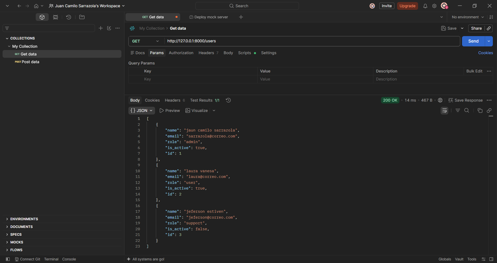
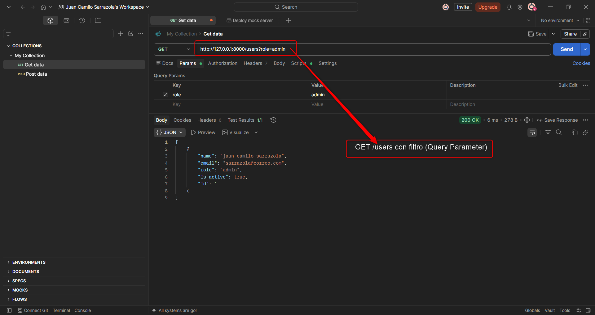
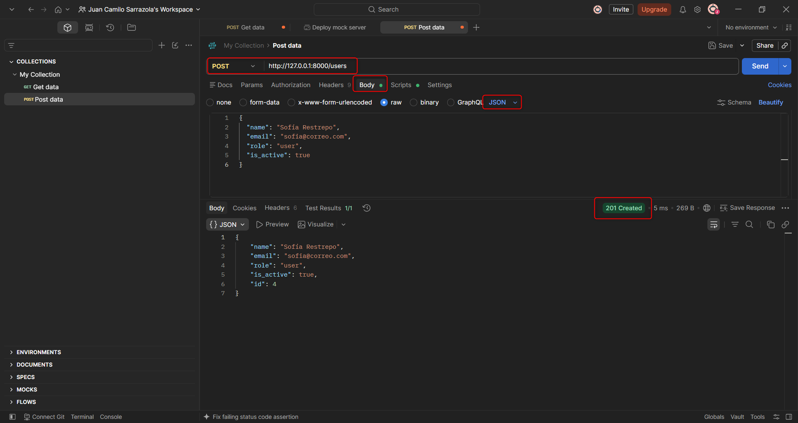
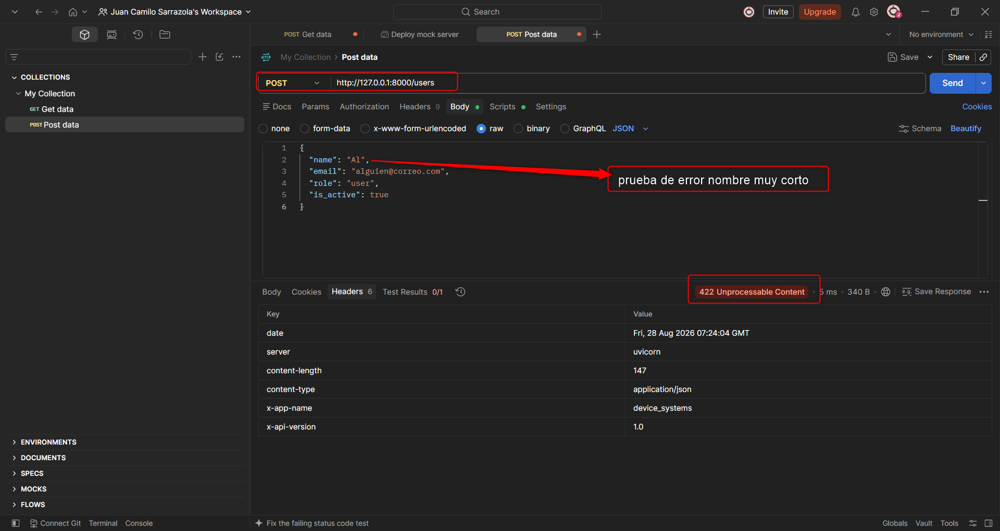

# FastAPI — API REST para Gestión de Usuarios: device_systems (GA1-220501096-01-AA1-EV07)

**Aprendiz:** Juan Camilo Sarrazola

## Descripción

`device_systems` es una API REST hecha con FastAPI para gestionar los usuarios de un sistema. Permite listar, filtrar, consultar por id, y registrar usuarios nuevos, con validación de datos y respuestas estructuradas.

## Estructura del proyecto

```
device_systems/
├── app/
│   ├── __init__.py
│   ├── main.py                  ← arranca la app, cabeceras personalizadas
│   ├── schemas/
│   │   ├── __init__.py
│   │   └── user_schema.py       ← modelos Pydantic (validaciones)
│   └── routes/
│       ├── __init__.py
│       └── user_routes.py       ← endpoints GET y POST de /users
├── images/                      ← capturas de pruebas (Postman)
├── requirements.txt
└── README.md
```

## Instalación de dependencias

```bash
# (opcional pero recomendado) crear un entorno virtual
python3 -m venv venv
source venv/bin/activate        # En Windows: venv\Scripts\activate

# instalar dependencias
pip install -r requirements.txt
```

## Ejecución del servidor

```bash
uvicorn app.main:app --reload
```

- La API queda disponible en: `http://127.0.0.1:8000`
- Swagger UI (documentación interactiva): `http://127.0.0.1:8000/docs`
- Documentación alternativa (ReDoc): `http://127.0.0.1:8000/redoc`

## Tabla de endpoints

| Método | Ruta | Descripción |
|---|---|---|
| GET | `/` | Mensaje de bienvenida |
| GET | `/users` | Lista todos los usuarios |
| GET | `/users?role=admin` | Filtra usuarios por rol (`admin`, `support`, `user`) |
| GET | `/users?is_active=true` | Filtra usuarios por estado activo/inactivo |
| GET | `/users/{user_id}` | Consulta un usuario puntual por su id |
| POST | `/users` | Registra un usuario nuevo |

Todas las respuestas incluyen las cabeceras personalizadas `X-App-Name: device_systems` y `X-API-Version: 1.0`.

## El modelo de usuario (Pydantic)

```python
class UserBase(BaseModel):
    name: str = Field(..., min_length=3)
    email: EmailStr
    role: Literal["admin", "support", "user"]
    is_active: bool = True
```

- **`name`**: obligatorio, mínimo 3 caracteres.
- **`email`**: debe tener formato de correo válido (`EmailStr` lo valida solo).
- **`role`**: solo acepta `"admin"`, `"support"` o `"user"` — cualquier otro valor da error automáticamente.
- **`is_active`**: booleano, `True` por defecto si no se envía.

Hay dos versiones del modelo: `UserCreate` (lo que se recibe en el POST, sin id) y `UserResponse` (lo que se devuelve, con id incluido) — así el cliente nunca tiene que inventar un id al crear un usuario.

## Ejemplos de peticiones

### GET /users

```bash
curl http://127.0.0.1:8000/users
```

```json
[
  {"id": 1, "name": "Ana Torres", "email": "ana@correo.com", "role": "admin", "is_active": true},
  {"id": 2, "name": "Luis Ramirez", "email": "luis@correo.com", "role": "user", "is_active": true}
]
```

### GET /users/{user_id}

```bash
curl http://127.0.0.1:8000/users/1
```

```json
{"id": 1, "name": "Ana Torres", "email": "ana@correo.com", "role": "admin", "is_active": true}
```

Si el id no existe, responde **404**:
```json
{"detail": "No existe un usuario con id 999"}
```

### GET /users?role=admin

```bash
curl "http://127.0.0.1:8000/users?role=admin"
```

### POST /users

```bash
curl -X POST http://127.0.0.1:8000/users \
  -H "Content-Type: application/json" \
  -d '{"name": "Sofía Restrepo", "email": "sofia@correo.com", "role": "user", "is_active": true}'
```

Respuesta (`201 Created`):
```json
{"id": 4, "name": "Sofía Restrepo", "email": "sofia@correo.com", "role": "user", "is_active": true}
```

### Evidencia de validaciones y errores

| Caso | Código | Respuesta |
|---|---|---|
| Correo ya registrado | `400` | `{"detail": "Ya existe un usuario registrado con el correo sofia@correo.com"}` |
| Nombre con menos de 3 caracteres | `422` | Error de Pydantic: `"String should have at least 3 characters"` |
| Correo con formato inválido | `422` | Error de Pydantic: `"value is not a valid email address"` |
| Rol no permitido (ej. `"superadmin"`) | `422` | Error de Pydantic: `"Input should be 'admin', 'support' or 'user'"` |
| Usuario con id inexistente | `404` | `{"detail": "No existe un usuario con id 999"}` |

## Evidencia de pruebas (Postman)

Las pruebas se realizaron con **Postman**, con el servidor corriendo localmente
(`uvicorn app.main:app --reload`).

### GET /users — listar todos



Responde `200 OK` con los 3 usuarios de ejemplo cargados al iniciar la API.

### GET /users?role=admin — filtro por Query Parameter



Responde `200 OK`, y la lista queda filtrada solo al usuario con `role: "admin"`.

### POST /users — registro exitoso



Responde `201 Created`, con el usuario guardado y su `id` asignado automáticamente.

### POST /users — validación de datos (error 422)



Al enviar un nombre de menos de 3 caracteres (`"Al"`), Pydantic rechaza la
petición antes de que llegue a la lógica de negocio, respondiendo `422
Unprocessable Content` con el detalle exacto del campo que falló.

En esta misma captura, en la pestaña **Headers** de la respuesta, se
confirma que las cabeceras personalizadas (`x-app-name: device_systems`,
`x-api-version: 1.0`) se agregan incluso en las respuestas de error, gracias
al middleware definido en `main.py`.


